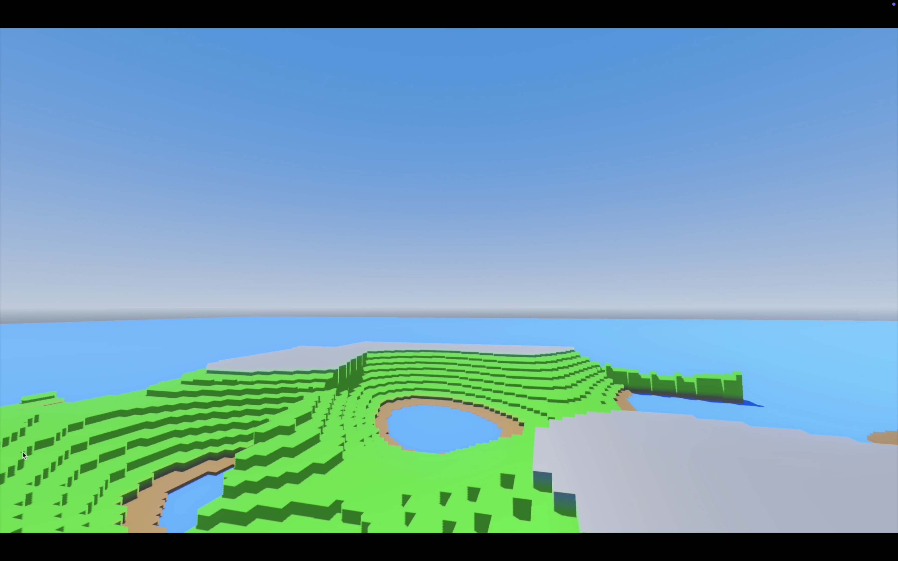
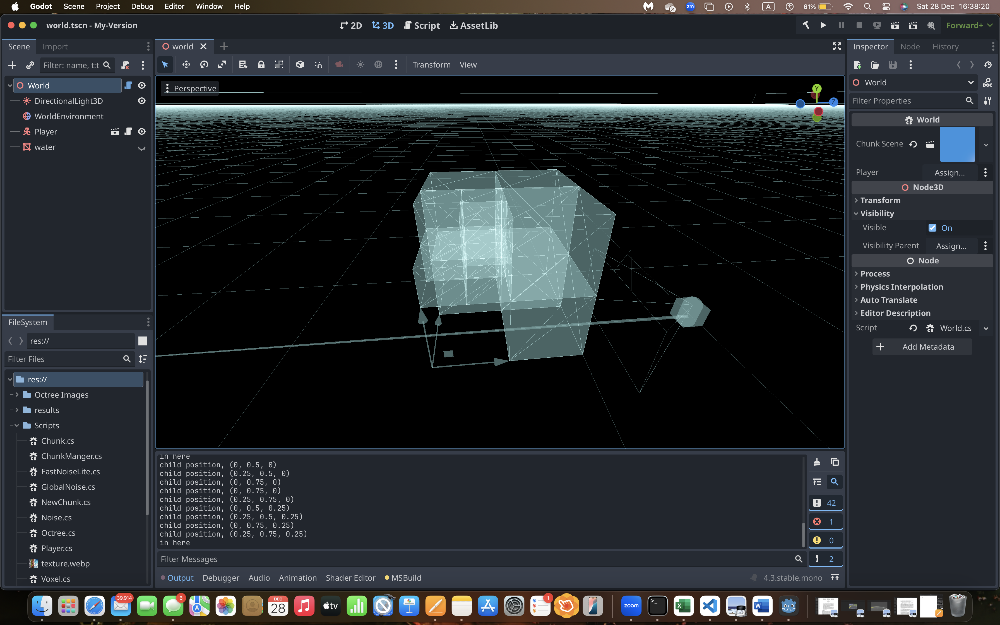
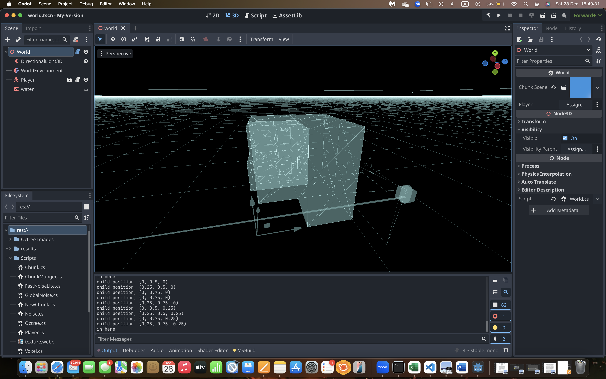

# Terrain Generation and OCTREE Blog:
## Dates:
- [20/11/2024](#20112024)
- [21/11/2024](#21112024)
- [22/11/2024](#22112024)
- [23/11/2024](#23112024)
- [24/11/2024](#24112024)
- [25/11/2024](#25112024)
- [27/11/2024](#27112024)
- [4/12/2024](#4122024)
- [5/12/2024](#5122024)
- [6/12/2024](#6122024)
- [18/12/2024](#18122024)
- [25/12/2024](#25122024)
- [26-27/12/2024](#2627122024)

## 20/11/2024:
- after our first meeting when you asked from me to read Building a High-Performance Voxel Engine in Unity artical and try to implement it.
- at first not all was making sense to me so at first i tried copy paste and see what happen, most of the time i got too many errors because some things does not match in Godot as in Unity. so i had to watch many tutorials to make the basics work.
- at first day i did not really progresses although is spent so much time learning things probably most of the day. (5 hours) I think that I spent more but it is okey.
  
the following two days were insane.

## 21/11/2024:
- this day I have started progressing. Of course like every coder when things stops to make sense we delete and start over, so i did that.
- i understood the mesh algorithm way more and started with the basics, with greedy mesh our goal is to render the visable faces for air and what the player sees. So i understand that each face is a square that construct from 2 triangles and each triagle is consist of 3 vertices. of course i know that but this is the key for greedy meshing
- so i succeeded in building a voxel with all of it's faces. and tried to continue with applying it for chunks which is the key here. but i did not progress as much as i thought because I encountered the same error multiple times (regarding PackedVecor3Array) which i sent you an email about. so decied it is enough for today.
- i worked on it for more than 8 hours, this include watching lectures, tutorials and having fun in the editor.

## 22/11/2024:
- I spent all day on the project. i solved the recent error and continued progressing, my goal was to apply greedy meshing for all chunks in the world, i succeeded only for not rendering invisible faces in the chunk it self but not the boundry faces (the ones between each chunk)
- i tried many thing but i did not progress mush here is how it looked [Watch the video](https://drive.google.com/file/d/1U0LGco8grP730v5HRNAZUZpkt0MRTjNm/view?usp=sharing)
- 8 hours.

## 23/11/2024: 
  - Did not work on the project.

## 24/11/2024:
  - Finally i manged to remove the redundant faces from inside the World, i was all the time looking for the wrong thing, the algorithm that they described is correct but it wasn't working for me. i tried to change and tried another things, but the problem was actually how Godot engine handle the scenes ... it not like Unity, so I had to do this to make it work: when generating the world in world.cs i must only create *all the CHUNKS* and  then generate mesh for each chunk on, because when the algortihm was trying to figure out if this face of the current chunk need to visible or not, the other chunk that is trying locate is not build yet. So, that was the probelm it is fixed now.
  - you can [Watch the video](https://drive.google.com/file/d/13EVmF7_wwM1A_7VxCsVTVv4LWW49fPCF/view?usp=sharing)
  - 4 hours.

## 25/11/2024:
  - To make our world look like terrain, we want to use Perlin Noise, but at first we want to do something easier and understand things. We generated noise using Sin function given frequency and amplitude.
  - To choose what is the voxel Type is if Air or Stone I did this:
	- surfaceY = &lambda;
	- $xOffset =  Sin(x * frequency) * amplitude$
	- $zOffset =  Sin(z * frequency) * amplitude$
	- return Stone if $current_voxel.positonY < surfaceY + xOffset + zOffset$ else Air
   
  - I learned this from a video on Youtube, here is the [link](https://www.youtube.com/watch?v=CSa5O6knuwI) if you are interested.

	Here are some photos of the results:
	- classifications are Stone and Air:
	- 
	- To see how greedy meshing works:
	- 

   
  - Press [here](https://drive.google.com/file/d/1SbUYPf3C9hNm6X1Xu3zTPQ145w-ETbE8/view?usp=sharing) to see video that visualise my world.
  - 3 hours
## 27/11/2024:
### Procedural Generation
-
- To do procedural generation, in the world class I defined a method that generate more chunks of our world according to the x and z axis in addition to a radius. I knew which chunks must be generated according to the player global position. to be more efficient we made sure not to generate chunks for positions that the player has been in more than once.
- To save resources I also destroyed chunks that are a far from the player global position by using unloalRradius > radius.
- inorder to have more random and smooth terrain, I chnaged the way we get noise. We used GlobalNoise.cs that is given in the arcticle and then we got the noise based on the x and z points then we normalized the noise to stay between [0,1].
- Before i forget, when the player moves in the world and new chunks are generated, if we look inside the world there still boundry mesh between the newly generated terrain and the one that has been geenrated in the previous frame, maybe we can solve it by setting a frame time which will help, but if we did not, the game becomes very slow due to many operations happen at once.
- I did not use texture, only colors, it was easier for to me now.
- 6 hours.
- you can watch the video of procedural generation by clicking [here](https://drive.google.com/file/d/1esg79KLc_E_xlj4RUUYRC174s3Jy_Nlx/view?usp=sharing) (BTW enjoy the music)

## 4/12/2024:
- I have been busy all week with another projct, what i tried to do today is adding the feature of breaking or placing block, to do that first I must add RayCast, then i added a BlockHighligth to view the block that i want to break or the poisition where i want to place a block. I encountered a problem with destroying the blocks, when i set the collisionShape of the chunk to be the arrayMesh.CreateTriMeshShape(), the raycast was not detecting anything, but if i go inside the world, strangley it was detecting blocks. But, we dont want that... so i tried to use CreateConvexShape. it worked for detecting blocks. So tried to break a block, it was deleted but stangley the collison shape of the block was not deleteed( i tried to do it manualy, but failed).
- most of the time I was not working on this issue, i was thinking of the most efficient way to break or place block in the matter of rendering meshes. they easy solution is after deleting the block (aka set it to air so we dont render it), is to regenrate the mesh for the current chunk.(as i searcehd the size of chunk in minecraft is (16,64,16)) so when the player break or place blocks we should regenrate meshes for all the visible faces it's quite a lot of work for updating one block. So, I was trying to figure out a better approach and i came up with something. when we break one block only the same block and it's neighbourhood get affected and nothing else, So, why we dont only regenrate meshs for these 7 blocks only(there are 6 neighbours ). Tomorrow I want to pursue this approach and try to make it work I already have an idea on what to do... . But before that i tried to do it with regenrate the mesh for the whole chunk and then encountered with the issue I mentioned earlier.
- for tomorrow:
  - fix the issue
  - efficient break and place blocks.

 - 9 hours

## 5/12/2024:

- Today I fixed the issue that i had before. after a lot of debugging it was an issue with tool that i have been using i switch from list that saves the triangles and vertices to SurfaceTool. but that didn't completely fixed my problem becasue i had another one which for some faces their coliisionShape are inside the block not in the outside, so i figured it out. i switched the face indices in the where i generate mesh and it worked, So by that i was manged to detect the objects using raycast.
- Now regarding deletion of blocks, I used this approach, i get the global position of the block using raycast, then i find the local position in that chunk. when i find the exact block I set it's type to Air then regenrate mesh for the current chunk.
- 7 hours

## 6/12/2024:
- Before trying to implement more efficient appraoch of block deletion, i wanted to check if evertying worked perfectly. I noticed that when i delete a block which lays at the boundry of the chunk, the face that connect the neighbouring chunk are still invisible but it shouldn't  be, so i had to regenrate mesh for all the neighbouring chunks to make all the invisible faces visible. for example (if the block's x position at the boundry (0 or chunksize - 1) i should regenerate mesh for the chunks that contain those blocks that are neighbours of the block that has  x position is 0 or chunksize - 1)
- regarding the efficient approach i tried multiple ways but i keep failing on how I can regenerating only the 7 needed blocks, i keep finding solutuon that their approach is based on regenrating the chunk whole mesh. (I will be glad for an assistance :))
- So i went and did the place block feature which is really much easier than break block. i used raycast.GetCollisionNormal to know where eaxcyly i want to place the block, but otherwise it was straightforward.
  
- Note: once i figure out the efficient approach regarding on how to regenerate mesh i can applay it to break and place block easily.
- 7 hours

- you can watch the video of breaking and placing by clicking [here](https://drive.google.com/file/d/1bIEB5QkIn7pQFPi5FgadgXiUNOmq3hPy/view?usp=sharing)

## 18/12/2024:
- I have optimzed the loading and unloading terrain based on the player position, from generating at each frame the terrain i chose a time interval based on it the engine will render and unrender the mesh, the data structure that helped me to acheive that is a Queue, one for loading chunks and one for unloading chunks. At each time interval the engine will render the mesh.
- I have tried to use threads in order to make it much faster but i didn't work for me well, maybe later on i will try again to make it work.
- 10 hours

## In the following dates, I worked on Octrees
- First I studied how an octree works.
- I designed a few algorithms that do the following tasks:
  - Searching for the node that need to be divided.
  - creation of octree nodes while breaking voxel.
  - Add mesh without redundant faces at each level of the octree nodes
  - Update mesh for the whole octree.

## 25/12/2024:
- After the meeting with Roi, I understood what was the requirement of the new task, which is when we use the Axe 🪓 to break block it must be divided each time we break to a more little voxels.
  The Data structure that can help me to implement such feature is an Octree. each node in an octree has 8 nodes. So when we break a voxel of size (1,1,1) it will be dived to 8 different voxels each one of them of size (0.5,0.5,0.5) and each time we break a voxel of size (0.5,0.5,0.5) we get 8 voxels of size (0.25,0.25,0.25) and so on.
- The next step is to to know what info is important to implmeent the octree data structure, each node must have:
  - 8 children
  - level (it will help us calculate the children position)
  - type (Air or not)
  - we will talk about more fields later on.
- For the Voxel object we added an  octree object as a field. So when we create each chunk voxels will be created, and then octree roots will be created.
- by using the collsion point of the player's axe we know exactly which voxel he hit, we need to work on this voxel:
  - we will locate the leaf that contains the collison point position.
  - we will use the method that creates children node for the root:
    - it create 8 children, their position will be calculated based on their parent position and the level they are at. For example, the root node is at position (0,0,0) with size 1 and at level 0. it's children we be at (0,0,0) , (0.5, 0, 0), (0.5, 0.5, 0), (0, 0.5, 0), (0,0,0.5) , (0.5, 0, 0.5), (0.5, 0.5, 0.5), (0, 0.5, 0.5). WHY 0.5? it is basically 0.5 to the power of level so 0.5^1 they are at level 1.
    - then to know which voxel child the player broke we are going to use the collsion point to find which child contain this psoition. then we set it to Air and the rest to Stone.
- This steps above describes all the work needed to creat an octree obejct on the following dates we will talk about mesh generation.
- I found this approach the easiest one and it's dynamic according to the player decisions in game.

- 8 hours

## 26-27/12/2024:
-Now we are going to test the if what we designed works or not, in order to that we we build mesh for each voxel. For now lets render all the faces of the mesh and to see if the breaking of voxel really works and each voxel divide into smaller voxels at each break.

Here is the result:
| Pose No.    | Normal | WireFrame  | OverDraw |
| ----------- | ---------- | ---------- | ----------------- |
| 1           |  |  |  |

- You can zoom in the images

- But as we can see we rendered also redundant faces, so to remove those. I focused on how they are constructed. for each node the common faces between each child are rendered so we must remove those, in order to do that we will use a pointer to the parent node in order to check for a child the it's visible faces in comparison for the his brothers.
This is one stage of optimization for rendered faces, means for each level there will be no redundent faces, but between each level there will be, In the future i will work in this. You can expolre more of my approach by dive into the code.

Here are the result of optimization:
| Pose No.    | Normal | WireFrame  | OverDraw |
| ----------- | ---------- | ---------- | ----------------- |
| 1           |  |  |  |

- In order to reallt see the difference we can look at the Over Draw view only:
- Before:
	- 
- After:
  	-

- Now is more easier to notice the changes

- You can also check this video for dynamic breaking in game, which you can allso visualise the octree being built click [here](https://drive.google.com/file/d/1_vW90q9lFrjVFm12ngtbRBT7FLGrG_sq/view?usp=sharing)

     
  
